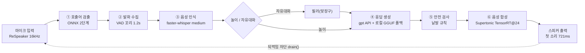

# 보고서 그림

## 그림 1 — 전면 API 구성 (`pipeline-realtime.svg`)

기술 상세 보고서 2.2절(운영 구성)의 그림이다. 위는 보드 안과 원격으로 나눈 구성, 아래는
Jetson 실기의 체감 지연 내역이다. 부호 ①~⑥은 로컬 구성(그림 2)과 같은 역할에 붙였다.

| 그림의 값 | 출처 |
|---|---|
| 체감 중앙 2.56 s · p90 3.33 s · 3.0 s 이내 14/18턴 | `reports/jetson/metrics_20260919.jsonl` (18턴) |
| 구간 중앙 무음 대기 1.40 / 받아 적기 0.48 / 요청→첫 소리 0.61 | 같은 파일 |
| 무음 900 ms, −0.28 s, 잘림 2 → 3% | `reports/turn/realtime_turn_end.md` (09-22) |
| 모델·목소리·받아 적기 모델 | `configs/model_paths.yaml` 의 `realtime` 항목 |

구간 중앙값의 합(2.49 s)은 체감 중앙값(2.56 s)과 다르다 — 그림 2와 같은 경고를 적었다.

## 그림 2 — 로컬 구성 블록도 (`pipeline-block.svg`)

기술 상세 보고서 2.3절(로컬 구성)과 6장(성능 실측)이 같이 쓰는 그림이다. 위쪽은 파이프라인, 아래쪽은 체감
지연의 내역이라 **"무엇이 있나"와 "어디서 시간을 쓰나"가 한 장에서 이어진다.**

- **넣는 법:** Word 2016 이후·한글 2020 이후·구글 문서는 SVG 를 그대로 삽입한다(벡터라
  확대해도 안 깨진다). PNG 가 필요하면 브라우저에서 열어 1000×640 으로 내보내면 된다.
- **고치는 법:** 텍스트 파일이라 숫자만 찾아 바꾸면 된다. 좌표는 왼쪽 위 원점 기준.

### 그림에 박힌 숫자의 출처

| 그림의 값 | 출처 |
|---|---|
| 체감 중앙 4.14 s · p90 5.07 s · 상한 3.0 s 이내 0% | `reports/jetson/metrics_20260907.jsonl` (`event: summary`) |
| 구간 중앙값 꼬리 1.12 / 인식 0.61 / 생각 1.57 / TTS 첫소리 0.76 | 같은 파일의 `*_median_s` |
| 재생 2.85 s | 같은 파일 `tts_play_median_s` (체감에 안 들어감) |
| 마이크 소음바닥 0.00698 | 2026-09-07 실기 로그 |
| 3\~6세 CER 31.5% | `reports/stt/README.md` (153발화·화자 114명) |
| 생각의 분해 왕복 89% / 생성 12% / 프롬프트 1% | `reports/bench/README.md` (08-28) |
| TTS 합성 817.0 → 453.8 ms | `configs/model_paths.yaml` 주석, `app/tts_module.py` (08-24) |
| 첫 소리 1,090 → 721 ms | 젯슨 TRT 적용 전후 (08-24) |
| Smart Turn 97.8% vs 37.3% | `reports/turn/README.md` |
| 깨움 1.3 s · 검증 0.85 s | 2패스 폐기(08-26) 및 호출어 교체(08-25) |

그림 1의 TTS 값은 09-12 에 정정했다 — 종전 '829.5 → 371.9ms' 는 근거 파일이 없었고, 코드·설정·테스트가 모두 817.0 → 453.8ms(TRT@24 채택값)를 적고 있다.

### 🔴 그림에 일부러 적어 둔 두 가지 경고

1. **구간별 중앙값의 합(4.06 s) ≠ 체감 중앙값(4.14 s).** 턴마다 긴 구간이 달라서다.
   이 프로젝트는 2026-09-01 에 단계별 중앙값을 더해 체감을 예측했다가 틀린 적이 있다.
2. **`PLAY_PAD_S = 0.15` 는 미계측이다.** 스피커가 없어서 도입 이래 한 번도 못 쟀다.
   숨기지 않고 그림에 적는다.

### 아직 그림에 없는 것 (의도적)

- 호출어 1단계/2단계의 내부 구조 — 필요하면 그림 2로 따로 그린다(특허 도면과 겹친다).
- 놀이 상호작용의 상태 전이 — `docs/superpowers/specs/2026-08-11-play-interaction-redesign-design.md`.

### 편집용 mermaid 원본 (구조만, 지연 없음)

## 도면 1 — 호출어 2단계 검증의 시점과 구간 (`wake-two-stage.svg`)

특허 정리 문서(`../patent/wake-two-stage-verification.md`)의 도면이다. 시간축 위에 1단계
점수, 후보 판정 시점, 지연 개시되는 검증 구간, 임베딩 열과 본보기 대조를 표시하고, 아래쪽에
구간이 짧아 유사도가 항상 0이 되는 구성을 대조로 함께 그렸다.

| 도면의 값 | 출처 |
|---|---|
| 프레임 80ms · 임베딩 96차원 · 요구 16개 · 최소 2.48초 | `reports/wake/ab_verify_20260911.md` |
| 대기 0.24/0.48초 검출 6·3 대 10·10 (11건) | 같은 문서, 노트북 진단 |
| 0/35 · 15/35 · 25/35 (젯슨 35건) | 같은 문서, 결과 표 |
| 검증 1회 0.78초 대 0.08초 | 같은 문서 |
