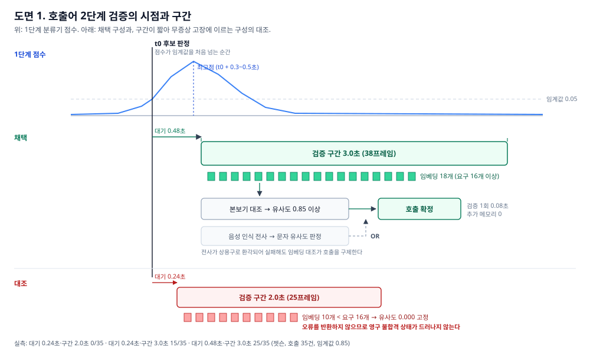

# 발명의 내용 설명서 (초안)

> 세종대학교 산학협력단 양식 `[양식] 2. 발명의내용설명서`의 칸별 내용이다.
> 🔴 **이 파일은 `tools/invention_desc_content.py` 에서 만들어진다. 여기를 고치지 말고
> 그 파일을 고친 뒤 `python tools/invention_desc_content.py` 를 돌릴 것.** 한글 파일
> (`제출 보고서/발명의내용설명서_재하봇_초안.hwp`)도 같은 원본에서 나온다.
> 호출어 부분의 상세 근거는 [wake-two-stage-verification.md](wake-two-stage-verification.md).

## 1. 발명의 명칭

**(한글)** 유아 대상 온디바이스 음성 대화 로봇 시스템 및 그 호출어 검출 방법

**(영문)** On-device voice conversation robot system for toddlers and wake-word detection method thereof

## 2. 도면의 간단한 설명

【도 1】 본 발명의 일 실시예에 따른 음성 대화 로봇 시스템의 구성과 구간별 실측 지연을 나타낸 블록도.

【도 2】 본 발명의 호출어 2단계 검증에서 검증 구간의 개시 시점과 길이를 시간축 위에 나타낸 타이밍도.

[부호의 설명]

도 1 — ①: 호출어 검출부  ②: 발화 수집부  ③: 음성 인식부  ④: 응답 생성부  ⑤: 안전 처리부  ⑥: 음성 합성부

도 2 — 110: 제1 검출기의 출력 점수  120: 후보 판정 시점  130: 점수 최고점  140: 대기 시간  150: 검증 구간  160: 임베딩 열  170: 본보기 임베딩  180: 호출 확정  190: 전사 판정

## 3. 발명의 상세한 설명

### 3.1 발명이 속하는 기술분야 및 가장 관련있는 논문 또는 특허 / 기술문서

본 발명은 만 2세 전후 유아와 음성으로 대화하고 놀이하는 로봇 시스템에 관한 것이다. 특히 단일 임베디드 보드에서 호출어 검출, 음성 인식, 응답 생성, 음성 합성을 수행하는 구성과, 그 가운데 호출어를 2단계로 검증하는 방법에 관한 것이다.

[가장 관련있는 특허문헌]

(특허문헌 1) KR 10-2024-0045171 A (주식회사 케이티) — 제1 신경망이 호출어 시작을 식별하면 제2 신경망으로 다시 판단하는 2단계 호출어 검출.

(특허문헌 2) KR 10-2022-0064979 A (주식회사 카카오엔터프라이즈) — 단말 1차 검출 후 서버 2차 검출.

(특허문헌 3) KR 10-2018-0055968 A (주식회사 인텔로이드) — 단말과 서버의 인식 결과 결합.

호출어 2단계 검증의 골격 자체는 위 문헌들로 공지되어 있다. 본 발명은 검증을 언제, 얼마 동안, 무엇으로 하는지에서 구별된다(3.4 참조).

[조사 범위] KIPRIS 국내 문헌을 2회(2026. 9. 11., 9. 14.) 검토하였고, 청구항 원문은 확인하지 못하였다. 정식 선행기술조사를 요청드린다.

### 3.2 그 분야 종래기술의 설명 및 문제점

(1) 성인용 음성 부품이 유아에게 맞지 않는다. 같은 코드 경로에서 측정한 결과, 문장 종료점 검출 재현율은 성인 97.8% 대 유아 37.3%, 음성 인식 문자 오류율은 성인 3.4% 대 유아 31.5%였다.

(2) 클라우드 음성 서비스에 유아의 음성을 보내기 어렵다. 주요 서비스의 약관이 18세 미만 대상 앱을 금지하거나 별도 승인을 요구하고, 유아 음성은 개인정보로서 보호 대상이다.

(3) 단일 보드에서 모든 처리를 하면 메모리가 부족하다. 8GB 보드에서 인식·합성·폴백 모델을 함께 올리면 여유가 거의 남지 않는다.

(4) 호출어 검출이 실제 환경에서 흔들린다. 경량 검출기 단독으로는 실제 거실에서 시간당 160회 오검출이 나왔다. 음성 인식으로 재검증하는 종래 방식은 짧은 음성을 엉뚱한 상용구로 전사하는 경우가 있어 정확히 부른 호출어를 놓치고, 1회 0.78초가 걸린다.

### 3.3 발명이 이루고자 하는 기술적 과제

(1) 유아의 음성을 기기 밖으로 보내지 않고 단일 보드에서 대화 루프를 완결한다.

(2) 유아가 응답을 기다리며 느끼는 침묵을 줄인다.

(3) 유아 대상 응답의 안전 조건을 확보한다.

(4) 추가 메모리 없이 호출어 오검출을 억제하면서 호출 검출률을 높인다.

### 3.4 발명의 구성 및 작용

[전체 구성 — 도 1]

NVIDIA Jetson Orin Nano 8GB 보드와 ReSpeaker USB 마이크(16kHz)로 구성한다. 입력 음성은 다음 순서로 처리된다.

① 호출어 검출부 — 자체 학습한 경량 분류기가 후보를 찾고, 2단계 검증으로 확정한다(아래 핵심 구성).

② 발화 수집부 — 무음이 일정 시간 이어지면 발화가 끝난 것으로 본다.

③ 음성 인식부 — 로컬 GPU에서 whisper medium 모델로 전사한다(유아 문자 오류율 31.5%로 상위 모델보다 정확).

④ 응답 생성부 — 원격 언어모델로 응답하고, 연결이 끊기면 필요할 때만 올리는 로컬 모델로 대신한다. 응답을 기다리는 동안 짧은 맞장구를 먼저 들려준다. 놀이 중에는 언어모델 대신 정답 낱말 대조로 판정한다.

⑤ 안전 처리부 — 위험한 소재가 나오면 어른에게 보내도록 하는 안전 규칙을 응답 생성 조건에 두고, 응답의 이모지·기호를 코드에서 다시 지우며, 소리 재생 요청은 언어모델이 아니라 정해진 낱말 규칙으로만 판정한다.

⑥ 음성 합성부 — 로컬 GPU에서 합성하고, TensorRT로 가속한다.

[핵심 구성 — 호출어 2단계 검증, 도 2]

제1 검출기의 점수(110)가 임계값을 넘으면 후보로 판정(120)한다. 이후 다음 세 가지를 결합하여 검증한다.

(가) 지연 개시 — 점수의 최고점(130)은 후보 판정보다 0.3~0.5초 뒤에 온다. 그래서 0.48초를 기다린 뒤(140) 검증 구간(150)을 연다.

(나) 구간 길이 — 비교에 필요한 임베딩 16개를 채울 수 있도록 구간을 3.0초로 잡는다. 구간이 짧으면 유사도가 오류 없이 늘 0이 되어, 검증기가 소리 없이 고장 난다.

(다) 추출기 재사용 — 제1 검출기가 이미 올려 둔 임베딩 추출기로 임베딩 열(160)을 뽑아 등록된 본보기(170)와 비교한다. 추가 메모리가 0이다.

보조로 음성 인식 전사 판정(190)과 논리합으로 결합하여, 전사가 틀려도 호출을 살린다.

[실시 결과]

- 시스템 전체(Jetson 실기, 성인 발화 5턴): 호출어부터 응답 음성까지 완주. 체감 응답 지연 중앙 4.14초, 첫 소리 721ms, 메모리 85%.

- 안전: 같은 안전 문항 14개에서 위험 응답이 안전 규칙 적용 전 15/28에서 적용 후 0/42로 줄었다.

- 호출어, 검증 구간 조건만 바꾼 실기 35건: 후보 직후 2.0초 0/35, 후보 직후 3.0초 15/35, 0.48초 뒤 3.0초 25/35.

- 호출어, 종래 전사 판정과 비교: 검증 시간 0.78초 → 0.08초, 거실 45분 헛깨움 2회 → 1회, 미학습 화자 15건 10 → 14건.

[종래기술과의 차이]

시스템 전체로는 유아 조건을 실측해 각 부품을 고르고, 유아 음성을 외부로 보내지 않는 단일 보드 구성으로 완결한 점이 다르다. 특허로 주장할 구성은 호출어 검증의 (가)·(나)·(다)의 조합이다. 특허문헌 1은 후보 식별 즉시 제2 신경망으로 인식하며, 검증 개시 지연, 구간 길이 결정, 추출기 재사용에 관한 한정이 없다.

[한계] 모든 실측은 성인 발화이고, 대상 유아가 실제로 사용한 적은 없다.

## 4. 특허청구범위

[청구항 1] 입력 오디오에서 호출어를 검출하는 호출어 검출부; 호출 확정 뒤 발화를 수집하여 문자로 변환하는 음성 인식부; 상기 문자에 대한 응답을 생성하는 응답 생성부; 및 상기 응답을 음성으로 출력하는 음성 합성부를 포함하고, 상기 호출어 검출부는 임베딩 추출기와 분류기를 포함하는 제1 검출기로 호출어 후보를 판정하고, 후보 판정 시점으로부터 소정의 대기 시간이 지난 시점에서 검증 구간을 개시하며, 상기 검증 구간의 오디오를 상기 제1 검출기의 임베딩 추출기에 입력하여 얻은 임베딩 열과 미리 등록된 본보기 임베딩의 유사도가 임계값을 넘으면 호출을 확정하는, 음성 대화 로봇 시스템.

[청구항 2] 제1항에서, 상기 대기 시간은 상기 분류기의 출력 점수가 최고점에 도달하는 지연에 근거하여 정해지는 음성 대화 로봇 시스템.

[청구항 3] 제1항에서, 상기 검증 구간의 길이는 상기 유사도 산출이 요구하는 최소 임베딩 개수를 만족하도록 정해지는 음성 대화 로봇 시스템.

[청구항 4] 제1항에서, 상기 호출어 검출부는 상기 검증 구간에 대한 음성 인식 전사의 문자 유사도 판정을 함께 수행하고, 두 판정 중 어느 하나가 충족되면 호출을 확정하는 음성 대화 로봇 시스템.

[청구항 5] 제1항에서, 상기 응답 생성부는 응답을 기다리는 동안 맞장구 음성을 먼저 출력하고, 원격 언어모델에 연결되지 않으면 로컬 언어모델을 적재하여 응답하는 음성 대화 로봇 시스템.

[청구항 6] 제1항의 호출어 검출부가 수행하는 호출어 검출 방법.
