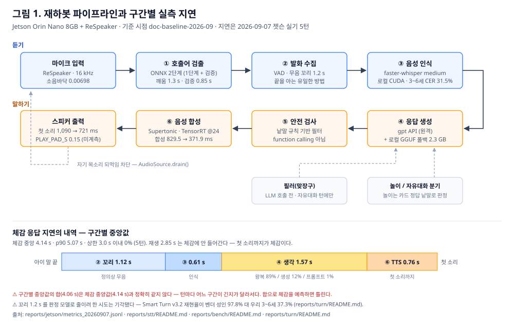

# 2세 유아용 음성 대화 로봇 개발 결과보고서

| 구분 | 내용 |
|---|---|
| 과 제 명 | 2세 유아를 대상으로 하는 온디바이스 음성 대화·놀이 로봇 (재하봇) |
| 수행 기간 | 2026. 8. 2. ~ 2026. 9. 30. |
| 수 행 자 | *(작성 필요: 학과 · 학번 · 성명)* |
| 지도 교수 | *(작성 필요)* |
| 제 출 일 | *(작성 필요)* |
| 기준 시점 | 태그 `doc-baseline-2026-09-12` (전면 API 전환 이전의 로컬 구성) |

---

## 1. 과제 개요

### 1.1 목표

만 2세 유아가 음성만으로 상호작용하는 대화·놀이 로봇을 단일 보드 위에서 구현한다.
세부 목표는 다음 세 가지로 설정하였다.

| 번호 | 목표 | 달성 |
|---|---|---|
| 1 | 호출어로 깨우고 말을 걸면 답하는 대화 루프를 단일 보드에서 동작시킨다 | 달성 |
| 2 | 체감 응답 지연을 3초 이내로 한다 | 미달 (중앙 4.14초) |
| 3 | 아동 대상 시스템의 안전 조건을 확보한다 | 부분 달성 |

### 1.2 추진 배경

대상 연령이 만 2세이므로 상호작용 수단이 음성으로 제한된다. 동시에 성인용 음성 처리
부품이 전제하는 조건(명확한 발음, 완결된 문장, 일정한 발화 속도)이 성립하지 않는다.
과제 착수 시 이 전제를 직접 측정하여 확인하였다.

| 확인 항목 | 성인 | 유아 (3~6세) |
|---|---|---|
| 문장 종료점 검출 재현율 | 97.8% | **37.3%** |
| 음성 인식 문자 오류율 | 3.4% (9세) | **31.46%** |

같은 코드 경로에서 측정한 값이다. 이 결과가 이후 모든 설계 결정의 근거가 되었다.

---

## 2. 시스템 구성

### 2.1 하드웨어

| 구분 | 사양 |
|---|---|
| 연산 장치 | NVIDIA Jetson Orin Nano 8GB (시스템·GPU 메모리 공유) |
| 음성 입출력 | ReSpeaker USB 마이크 어레이, 16kHz 단일 채널 |
| 출력 | ReSpeaker 3.5mm 잭 (스피커 미확보, 이어폰으로 검증) |

### 2.2 처리 흐름

*그림 1. 파이프라인 구성과 구간별 실측 지연*

### 2.3 적용 모델

| 단계 | 모델 | 실행 위치 | 선정 근거 |
|---|---|---|---|
| 호출어 검출 | 자체 학습 ONNX 분류기 v6 | 로컬 | 화자 홀드아웃 재현율 97.6% |
| 호출어 검증 | 임베딩 대조 + whisper 전사 | 로컬 | 1단계 단독은 시간당 160회 오검출 |
| 음성 인식 | faster-whisper medium | 로컬 CUDA | 3~6세에서 상위 모델보다 정확 |
| 응답 생성 | gpt-4o-mini | 원격 API | 로컬 대비 0.6초 빠르고 메모리 2.3GB 절약 |
| 응답 생성(폴백) | EXAONE-3.5-2.4B Q4 | 로컬, 지연 적재 | 연결 실패 시 대비 |
| 음성 합성 | Supertonic + TensorRT @24 | 로컬 CUDA | 합성 817 → 454ms |

### 2.4 구현 범위

| 기능 | 상태 | 비고 |
|---|---|---|
| 호출어 검출 | 구현 | |
| 음성 인식 | 구현 | |
| 응답 생성 | 구현 | 원격 + 로컬 폴백 |
| 음성 합성 | 구현 | |
| 놀이 상태머신 | 부분 | 5종 중 2종 동작 |
| 소리·노래 재생 | 구현 | 기본 비활성, 시연 기기에서만 활성 |
| 안전·날조 판정기 | 평가 전용 | 운영 경로 미연결 |
| 비전 | 미구현 | 메모리 여유 부족 |
| 부모 브리핑 | 미구현 | |

---

## 3. 수행 방법

### 3.1 측정 원칙

본 과제는 선택지마다 실측으로 판단하는 방식을 취하였다. 적용한 원칙은 다음과 같다.

1. 측정 도구는 운영 코드의 판정 경로를 그대로 호출한다. 도구 안에서 재구현하지 않는다.
2. 벤더 공개 수치를 그대로 인용하지 않는다. 동일 조건에서 재측정한 값만 사용한다.
3. 결론을 뒤집을 수 있는 수치는 원본 로그와 대조한 뒤 인용한다.

3항을 원칙으로 세운 이유는 측정 도구의 결함으로 결론이 뒤집힌 사례가 4건 발생했기
때문이다. 해당 사례는 별첨 1의 4.9절에 기록하였다.

### 3.2 사용 데이터

| 데이터 | 출처 | 규모 | 용도 |
|---|---|---|---|
| 아동 음성 | AI-Hub 공개 데이터 | 3\~6세 153발화, 화자 114명 | 인식·종료점 검출 측정 |
| 성인 실음성 | 자체 녹음 | 20건 | 호출어 검증 |
| 호출어 학습 | 합성 음성 | 긍정 4,020건, 부정 20.71시간 | 분류기 학습 |
| 안전 평가 문항 | 자체 작성 | 14문항 (가상 유아 발화) | 안전성 측정 |

아동 음성은 전량 공개 데이터이며, 실제 아동을 녹음한 사례는 없다. 안전 평가 문항은
사람이 작성한 가상 발화로, 아동의 실제 녹취를 외부 API로 전송한 사례는 없다.

---

## 4. 수행 결과

### 4.1 성능 측정

2026년 9월 7일 Jetson 실기 시험 5턴의 계측값이다. 체감 지연은 아이가 말을 끝낸 시점부터
로봇의 첫 소리가 나오는 시점까지로 정의한다.

| 항목 | 값 |
|---|---|
| 체감 응답 지연 (중앙) | **4.14초** |
| 체감 응답 지연 (90분위) | 5.07초 |
| 3초 이내 비율 | 0% (0/5턴) |
| 구간 내역 | 무음 대기 1.12 + 인식 0.61 + 응답 생성 1.57 + 합성 0.76 |
| 첫 소리까지 | 721ms (TensorRT 적용 전 1,090ms) |
| 시스템 메모리 | 6,482 / 7,607MB (85%) |

목표 3초에 미달하였다. 원인은 다음과 같이 분해된다.

- **무음 대기 1.12초** — 발화 종료를 아는 수단이 무음 계수뿐이다. 판정 모델로 줄이려는
  시도는 유아 음성에서 기각되었다(4.3절).
- **응답 생성 1.57초** — 이 중 89%가 서버 처리 시간이다. 프롬프트 축소나 모델 교체로
  줄일 수 없음을 측정으로 확인하였다.

즉 남은 수단은 구성 변경뿐이며, 그 검토 결과가 별첨 3이다.

### 4.2 주요 설계 결정

| 결정 | 대안 | 근거 |
|---|---|---|
| 호출어를 '하이 티드'로 교체 | 기존 '재하봇' 유지 | 36개 중 35개 정확 전사 대 0개. 검증 1.7 → 0.85초 |
| 호출어 검증 2단계 구성 | 1단계 단독 | 1단계 단독은 실제 거실에서 시간당 160회 오검출 |
| 음성 인식 medium 채택 | large-v3-turbo | 3~6세에서 오류율 31.5% 대 36.4%. 더 빠르고 메모리도 적다 |
| 음성 합성 TensorRT @24 | CUDA @12 | 817 → 454ms. @12는 잡음이 있어 기각 |
| 응답 대기에 맞장구 삽입 | 무음 유지 | 아이의 재발화를 막는다 |
| 소리 재생은 낱말 규칙 | 언어모델 function calling | 규칙은 결정적, 모델은 무작위 오호출 |
| 음악은 파일 재생·공식 임베드 | 스트리밍 API | 서비스 약관상 전 경로 폐쇄 |

### 4.3 검토 후 미채택 항목

도입을 검토하였으나 측정값이 이득을 지지하지 않아 채택하지 않은 항목이다. 각 항목의
측정 방법과 전체 수치는 별첨 1에 있다.

| 항목 | 기대 | 측정 결과 |
|---|---|---|
| 오디오 기반 종료점 검출 | 무음 대기 1.0초 절감 | 유아 재현율 37.3%, 실이득 0.05초 |
| 언어모델 공급자 전환 | 응답 0.39초 절감 | 실행 간 변동 1.0초로 차이가 측정되지 않음 |
| 예시를 대화 형식으로 제공 | 응답 길이 규칙 준수 | 예시 주제가 답변에 누출 |
| 문장 단위 합성 스트리밍 | 첫 소리 단축 | 이득 0.047초 (합성은 고정비용 지배) |
| 호출어 1단계 단독 | 검증 비용 제거 | 시간당 160회 오검출 |
| 호출어 우회 판정 | 검증 생략 | 소음과 실제 호출의 점수 분포가 겹침 |
| 한국어 파인튜닝 인식 모델 | 정확도 향상 | 오류율 21~27% (순정 2.96%) |
| 음악 스트리밍 API | 동요 재생 | 전 서비스 약관상 불가 |
| 클라우드 스트리밍 인식 | 선행 인식 발동률 향상 | 상한이 41%이고 로컬로 이미 33.3% 확보 |

### 4.4 안전성 확보

착수 초기, 위험한 대상을 언급한 발화에 로봇이 함께 찾자고 제안하는 사례가 확인되었다.
이를 계기로 판정 기준을 재정의하고 시스템 프롬프트에 안전 규칙을 적용하였다.

동일한 안전 문항 14개에 대해, 시점별 응답 로그를 현재 판정기로 재채점한 결과다.

| 시점 | 모델 | 반복 | 프롬프트 | 위험 응답 |
|---|---|---|---|---|
| 08-07 | gpt-4o-mini | 14×2 | 안전 규칙 없음 | **15/28** |
| 08-07 | 로컬 EXAONE | 14×2 | 안전 규칙 없음 | 3/28 |
| 08-11 | gpt-4o-mini | 14×3 | 안전 규칙 적용 | **0/42** |
| 08-12 | gpt-4o-mini | 14×3 | 최종 | **0/42** |

프롬프트 강화 이전의 일반 문항 64개를 세 모델에 물은 로그를 같은 판정기로 채점하면
위험 응답이 각각 6건, 8건, 2건으로 세 모델 모두 실패한다. 원인이 모델 선택이 아니라
프롬프트 설계였음을 뒷받침한다.

다만 세 가지를 한계로 기록한다.

1. 이 규칙 묶음은 이미 용량 한계다. 안전 규칙에 세 줄을 추가하자 다른 문항에서 어른
   유도가 사라졌고, 같은 규칙을 한 줄로 줄이자 회복되었다. 내용이 아니라 분량이 원인이다.
2. 자동 판정기는 사람보다 못 잡는다. 위 3항의 이상을 자동 판정기는 통과시켰고, 사람이
   답변 전문을 읽고 찾았다. 따라서 위 표의 0건은 하한이다.
3. 평가 문항은 전부 가상의 유아 발화다.

---

## 5. 지식재산권

### 5.1 선행기술 조사

특허청 KIPRIS 국내 검색 5개 검색식과 해외 공개공보 예비 조사를 수행하였다. 검색식별
상위 10건을 검토하였으며, 분류 기반 전수 조사와 대리인을 통한 정식 조사는 수행하지
않았다.

| 후보 | 조사 결과 |
|---|---|
| 아동 발화 종료점 적응 검출 | 선행특허와 중첩. 또한 해결수단이 구현되어 있지 않음 |
| 체감 지연 은닉(맞장구) | 선행특허가 동일 범위까지 청구 |
| 호출어 문구 선정 방법 | 선행특허와 정면 충돌 |
| 재생 전 안전 검사 | 2024년 공개 연구가 있어 진보성 위험 |
| **호출어 2단계 검증** | **출원 후보로 유지** |

### 5.2 출원 후보

유지한 1건은 2단계 검증의 **시점 조건**을 핵심 한정으로 한다. 2단계 구조 자체는 국내
선행특허가 이미 공개하였으므로, 그 부분은 주장하지 않는다.

시점 조건의 효과는 별도로 분리 측정하였다.

| 검증 구간 조건 | 호출 검출 (35건) |
|---|---|
| 후보 직후 개시, 구간 2.0초 | 0/35 |
| 후보 직후 개시, 구간 3.0초 | 15/35 |
| **후보 후 0.48초 개시, 구간 3.0초** | **25/35** |

같은 모델과 같은 임계값에서 시점 조건만으로 검출이 증가한다. 대기 시간을 더 늘리면
다시 감소하므로(0.80초 9/11, 1.04초 7/11), 단순한 지연 추가와 구별된다.

명세서 초안과 도면은 별첨 2에 있다.

### 5.3 출원 일정

> **작성 필요:** 출원 여부가 확정되면 아래 중 하나를 선택하여 기재한다.

| 방식 | 비용 | 시점 |
|---|---|---|
| 임시명세서(가출원) | 관납료 13,800원 | **보고서 공개 전**. 1년 내 정식 출원으로 전환 |
| 공지예외 주장 | — | 보고서 공개 후 12개월 내 출원, 30일 내 증명서류. 국내 한정 |

---

## 6. 한계 및 향후 계획

### 6.1 한계

| 구분 | 내용 |
|---|---|
| 대상 아동 미검증 | 실기 수치가 전부 성인 발화다. 만 2세에서의 동작은 확인되지 않았다 |
| 음향 결합 미검증 | 스피커 미확보. 재생 선행 여유값은 도입 이래 미측정이다 |
| 오검출 목표 미달 | 거실 환경 시간당 1.33~2.67회 (목표 1회 이하) |
| 안전 판정기 미연결 | 평가 지표로만 동작하며 운영 경로의 가드로 연결되어 있지 않다 |
| 학습 데이터 | 호출어 분류기의 학습 데이터에 실제 아동 음성이 포함되지 않았다 |
| 메모리 여유 | 85% 점유 상태로, 로컬 폴백 적재 시 부족 위험이 있다 |

### 6.2 향후 계획

| 순위 | 과제 | 선행 조건 |
|---|---|---|
| 1 | 대상 아동 실사용 시험 | 기관생명윤리위원회 심의, 법정대리인 동의 |
| 2 | 스피커 확보 후 음향 결합 계층 검증 | 스피커 |
| 3 | 오검출을 목표 이내로 조정 | 수 시간 연속 측정 |
| 4 | 안전 판정기의 운영 경로 연결 | — |
| 5 | 아동 실음성으로 호출어 검출기 재평가 | 1항과 동일 |

### 6.3 연구 윤리

아동 음성을 결과로 사용하려면 다음이 선행되어야 한다.

- 대학 연구 과제는 개인정보 보호법의 적용을 받는다. 만 14세 미만은 법정대리인의 동의가
  필요하며(제22조의2), 국외 이전 시 별도 근거가 요구된다(제28조의8).
- 아동은 취약한 연구 대상이므로 기관생명윤리위원회 심의가 선행되어야 하고, 심의 면제
  사유에 해당하더라도 법정대리인의 서면 동의는 면제되지 않는다.
- 본 보고서의 아동 관련 수치는 전량 공개 데이터(AI-Hub)에 근거하며, 이용 조건에 따라
  활용 사실을 명시하고 원천 데이터는 재배포하지 않았다.

> **작성 필요:** 별첨 3의 API 성능 비교 과정에서 AI-Hub 아동 음성 40건을 외부 API로
> 전송하였다. 구글 API의 무료 등급은 전송 데이터를 학습에 사용하므로, 해당 측정에
> 사용한 계정의 등급을 확인한 뒤 그 결과를 이 절에 한 줄로 기재한다.

---

## 7. 참고 자료

**데이터** — AI-Hub 한국어 아동 음성(#108 AI챗봇 수집분, #003 Validation), 공유마당 공개 음원

**모델·라이브러리** — faster-whisper, Supertonic TTS(ONNX Runtime / TensorRT),
Smart Turn v3.2(검토 후 기각), OpenAI gpt-4o-mini · gpt-realtime · gpt-4o-transcribe,
네이버 클로바 HCX-005(검토 후 보류), EXAONE-3.5-2.4B

**선행 특허** — EP 3163568, US 11048995 B2, KR 10-2017-0035231, CN 116884407 A,
US 11783818 B2, US 9275637 B1

**법령·제도** — 개인정보 보호법 제22조의2·제28조의8, 저작권법 제30조, 공지예외 주장 제도,
임시명세서 출원 제도, 기관생명윤리위원회 심의 기준

**시장 자료** — Common Sense Media 아동용 AI 장난감 권고(2026. 1.), Embodied Moxie
서비스 종료 사례(2025. 1.)

---

## 별첨

| 번호 | 문서 | 내용 |
|---|---|---|
| 1 | [기술 상세 보고서](report.md) | 설계 결정과 측정의 전체 기록. 본문의 모든 수치의 근거 |
| 2 | [특허 정리](patent/wake-two-stage-verification.md) | 명세서 초안, 청구항, 선행기술 대비, 도면 |
| 3 | [API 전환 검토](api-전환안.md) | 전면 API 구성의 측정 결과와 제약 |
| 4 | 시연 영상 | *(작성 필요: 녹화 후 링크 또는 파일명 기재)* |

**근거 자료 위치** — 모든 측정의 원본 로그는 저장소 `reports/` 아래에 있다. 장별 대응은
별첨 1의 부록 B에 정리하였다. 본문에서 인용한 코드 상태는 태그
`doc-baseline-2026-09-12`로 고정되어 있다.
